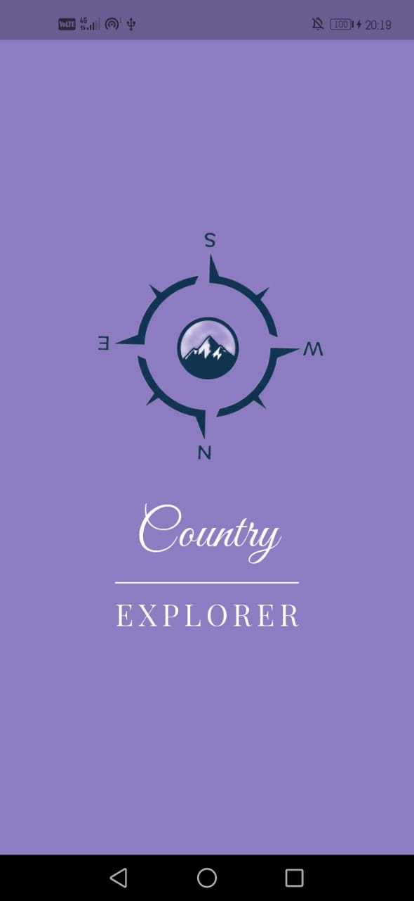
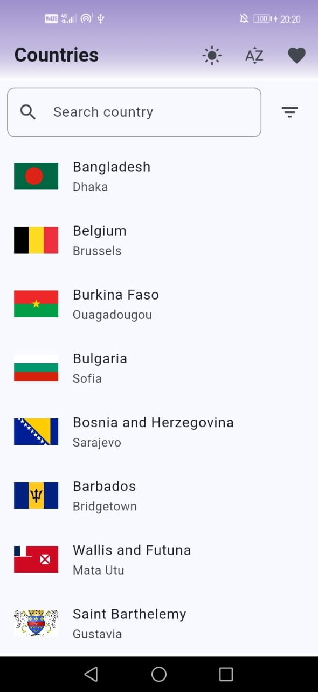
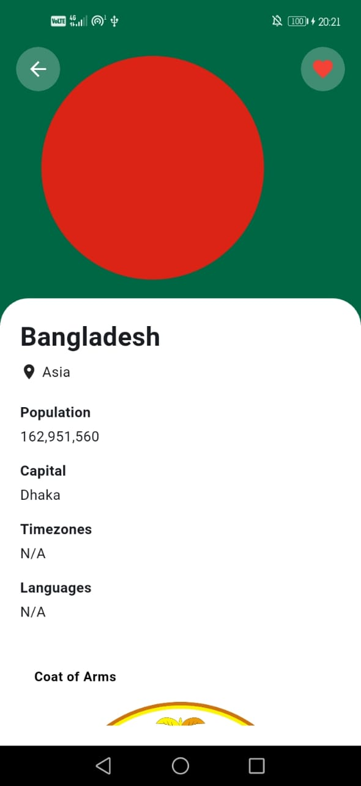
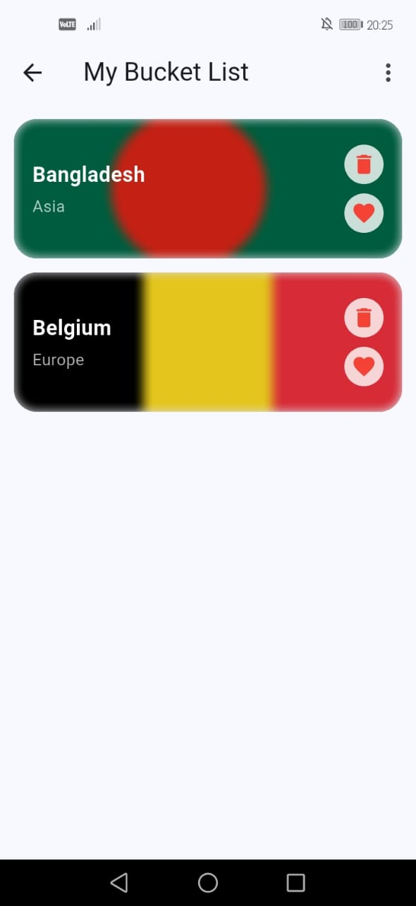

## Country Explorer – Flutter App
Country Explorer is a modern Flutter mobile application that allows users to explore countries around the world with rich details and offline capabilities.
The app fetches country data from a REST API and enables users to save personal notes and maintain a bucket list locally for seamless offline access.

## Features
- Splash screen with app logo and name
- Country list with:
  - Search by country name
  - Filter by region/continent (Asia, Europe, Africa, etc.)
  - Sorting (A–Z, Z–A)
  - Shimmer/Pulse loading effect
  - Error state UI
  - Pull-to-refresh
- Country details screen: 
  - Flag, country name, capital, region, population, timezones, languages, coat of arms and map
  - Add/edit/delete personal notes saved locally
- Bucket list screen:
  - Save favorite countries locally
  - Offline access using local storage
  - Remove countries from bucket list
  - Sorting by name or region
- UI & UX
  - Material 3 design
  - Responsive layout
  - Hero animations for flag transition
  - Cached network images
  - Optional dark mode support

## Tech Stack
- Flutter
- Dart
- Riverpod (state management)
- REST API
- Hive / SharedPreferences (local storage)

## State Management
This project uses Riverpod for state management.
The controllers/ folder contains Riverpod providers to manage application state.

Why Riverpod?
- Reactive and testable state management
- Decouples UI from business logic
- Easy to scale for larger projects

Key Providers:
- country_list_provider.dart
Handles fetching country data, search, filtering, sorting, and loading/error states.

- bucket_list_provider.dart
Manages local storage for bucket list and notes.

## Architecture Overview
lib/
├─ api/          # API services to fetch country data
├─ controllers/  # Riverpod providers (country_provider,bucketlist_provider,theme_provider)
├─ db/           
├─ models/       # Data models (country_model)
├─ screens/      # UI pages (splash_screen, home_screen, country_details_screen, bucket_list_screen)
├─ utils/        
├─ widgets/      # Reusable UI components (country_card, search_bar, loading_shimmer)
main.dart

## Getting Started

1. Clone the repository
    git clone https://github.com/DencyMona/country_explorer.git

2. Navigate to the project directory
    cd country_explorer

3. Install dependencies:
    flutter pub get

4. Run the app:
    flutter run

## Screenshots

## Download APK
 the APK here: https://drive.google.com/file/d/1OZ7UuESW7R6PRKcwlWQCP7g0KLQFQ-7N/view?usp=sharing